# EcoLearn System - Flow Charts and HIPO Diagrams

## System Architecture Overview

EcoLearn is a comprehensive environmental education and waste management platform for Zambia, featuring multilingual support, community engagement, gamification, and real-time notifications.

## 1. System-Level Flow Chart

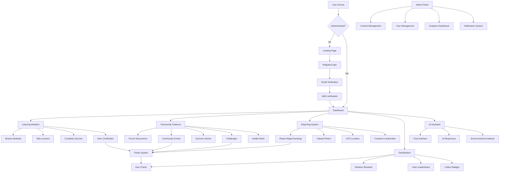

## 2. User Authentication Flow

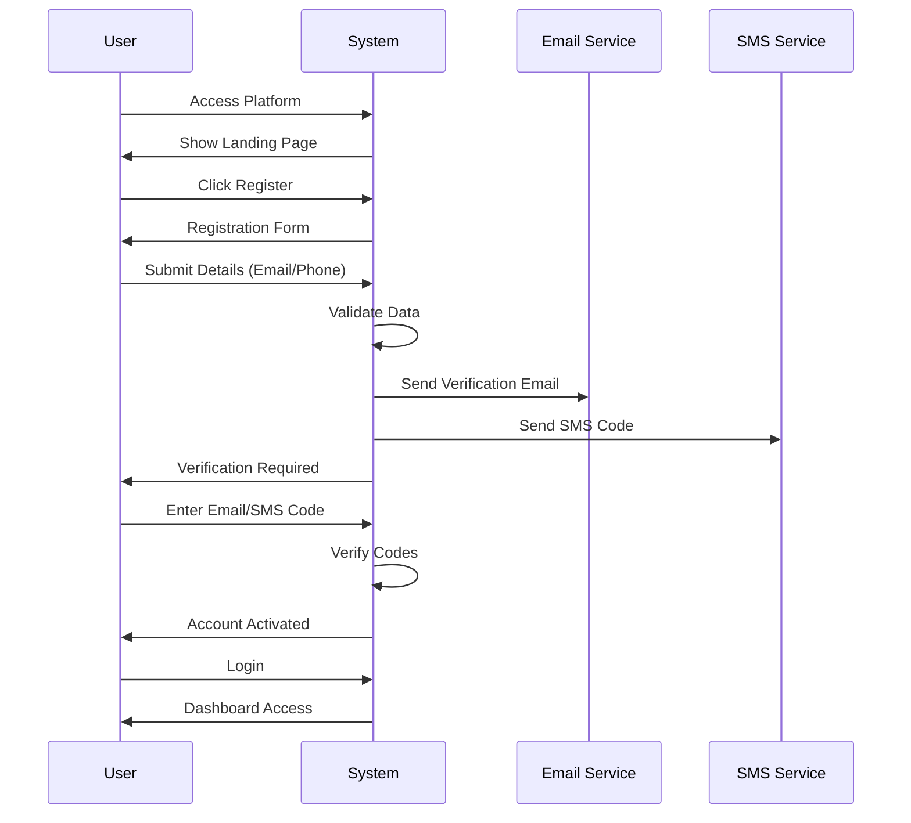

## 3. Learning Module Flow

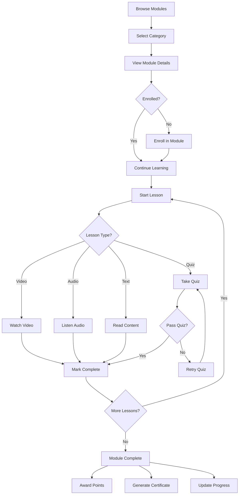

## 4. Community Engagement Flow

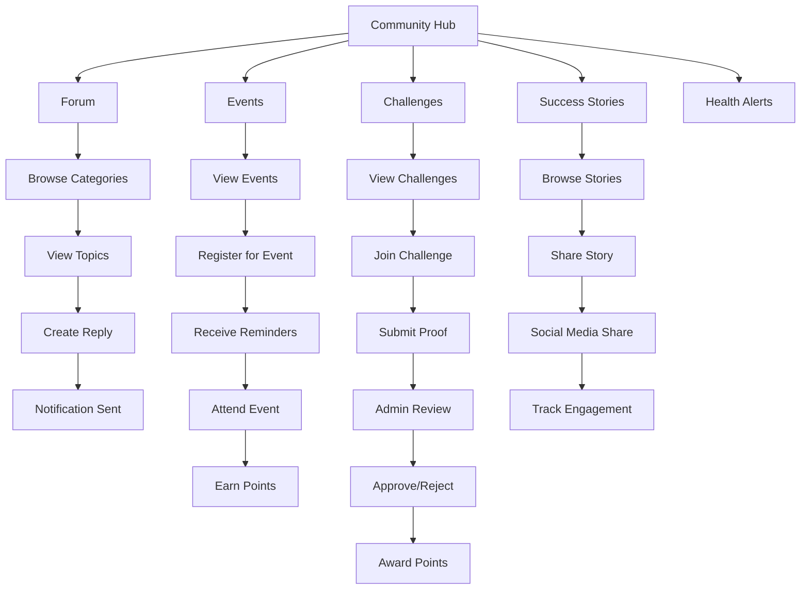

## 5. Illegal Dumping Reporting Flow

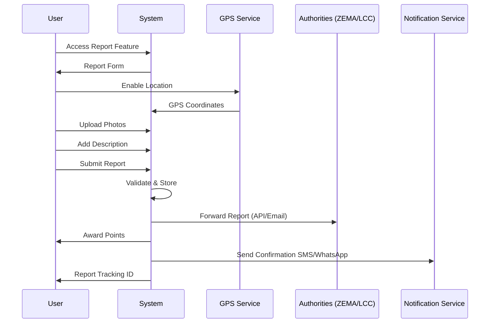

## 6. Gamification System Flow

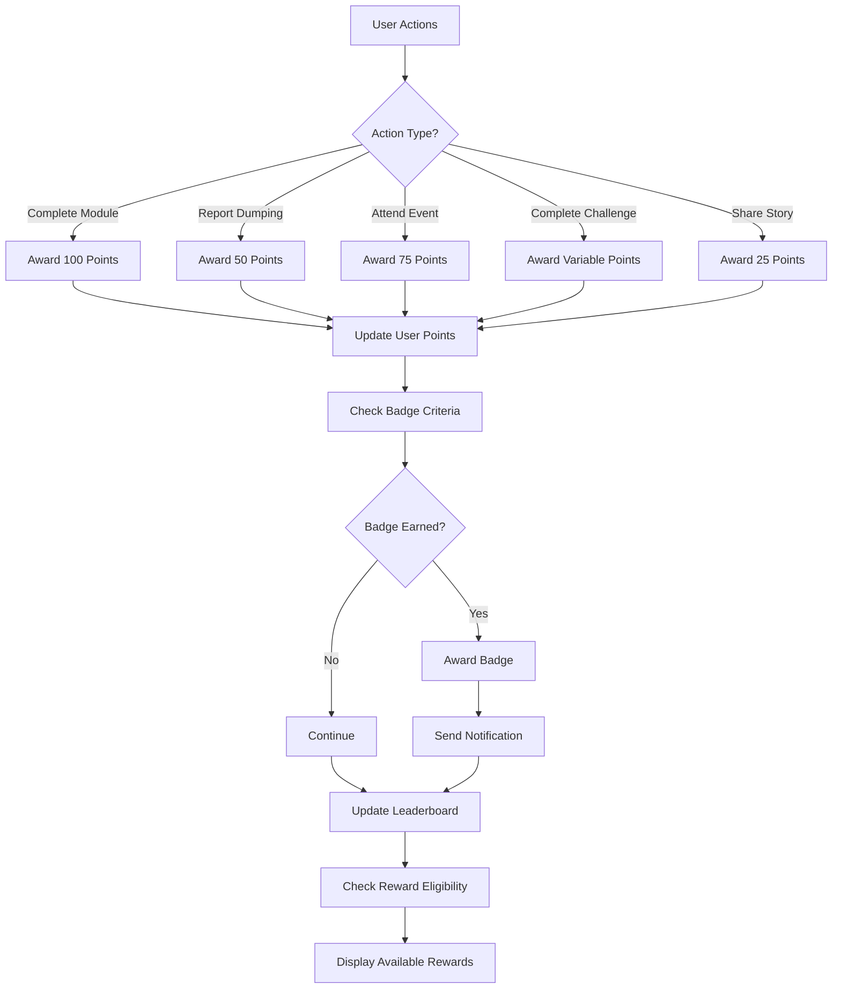

## 7. Notification System Flow

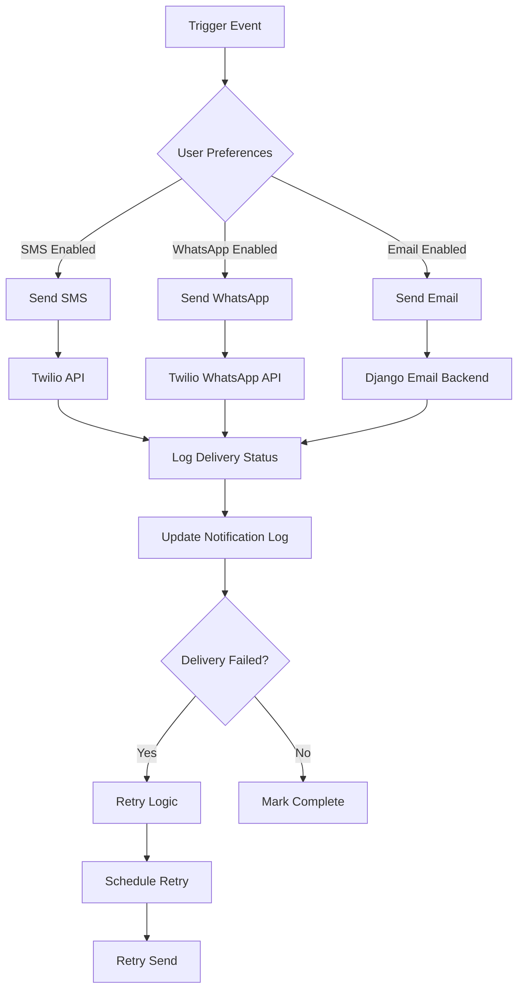

## 8. HIPO Diagram - Main System

### Level 0: EcoLearn Platform Overview
```
┌─────────────────────────────────────────────────────────────┐
│                    ECOLEARN PLATFORM                        │
│                                                             │
│  Input: User Requests, Admin Actions, External APIs        │
│  Process: Education, Community, Reporting, Gamification    │
│  Output: Learning Progress, Reports, Notifications, Points │
└─────────────────────────────────────────────────────────────┘
```

### Level 1: Main Functional Areas
```
┌─────────────────┐  ┌─────────────────┐  ┌─────────────────┐
│   1.0 USER      │  │   2.0 LEARNING  │  │  3.0 COMMUNITY  │
│  MANAGEMENT     │  │    SYSTEM       │  │   ENGAGEMENT    │
│                 │  │                 │  │                 │
│ • Registration  │  │ • Modules       │  │ • Forum         │
│ • Authentication│  │ • Lessons       │  │ • Events        │
│ • Profiles      │  │ • Quizzes       │  │ • Challenges    │
│ • Preferences   │  │ • Certificates  │  │ • Stories       │
└─────────────────┘  └─────────────────┘  └─────────────────┘

┌─────────────────┐  ┌─────────────────┐  ┌─────────────────┐
│  4.0 REPORTING  │  │ 5.0 GAMIFICATION│  │  6.0 ADMIN      │
│    SYSTEM       │  │    SYSTEM       │  │  MANAGEMENT     │
│                 │  │                 │  │                 │
│ • Dump Reports  │  │ • Points        │  │ • Content Mgmt  │
│ • GPS Tracking  │  │ • Rewards       │  │ • User Mgmt     │
│ • Photo Upload  │  │ • Leaderboard   │  │ • Analytics     │
│ • Authority Fwd │  │ • Badges        │  │ • Notifications │
└─────────────────┘  └─────────────────┘  └─────────────────┘
```

### Level 2: Learning System Detail
```
┌─────────────────────────────────────────────────────────────┐
│                    2.0 LEARNING SYSTEM                      │
├─────────────────┬─────────────────┬─────────────────────────┤
│   2.1 CONTENT   │   2.2 PROGRESS  │    2.3 ASSESSMENT       │
│   MANAGEMENT    │    TRACKING     │                         │
│                 │                 │                         │
│ • Categories    │ • Enrollment    │ • Quizzes               │
│ • Modules       │ • Completion    │ • Questions             │
│ • Lessons       │ • Time Spent    │ • Answers               │
│ • Multilingual  │ • Certificates  │ • Scoring               │
└─────────────────┴─────────────────┴─────────────────────────┘
```

### Level 2: Community System Detail
```
┌─────────────────────────────────────────────────────────────┐
│                   3.0 COMMUNITY ENGAGEMENT                  │
├─────────────────┬─────────────────┬─────────────────────────┤
│   3.1 FORUM     │   3.2 EVENTS    │    3.3 CHALLENGES       │
│    SYSTEM       │    SYSTEM       │                         │
│                 │                 │                         │
│ • Categories    │ • Event Mgmt    │ • Challenge Creation    │
│ • Topics        │ • Registration  │ • Participation         │
│ • Replies       │ • Reminders     │ • Proof Submission     │
│ • Moderation    │ • Attendance    │ • Admin Review          │
└─────────────────┴─────────────────┴─────────────────────────┘
```

## 9. Data Flow Diagram

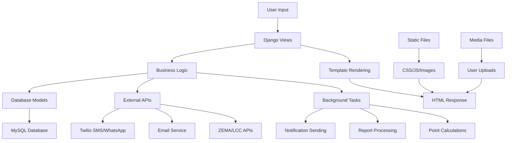

## 10. System Integration Architecture

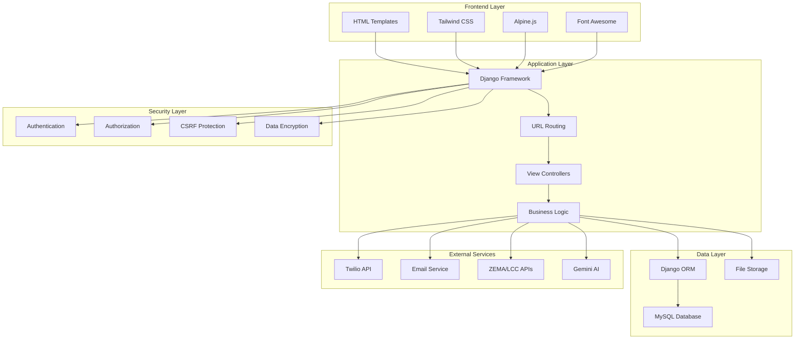

## 11. Deployment Architecture

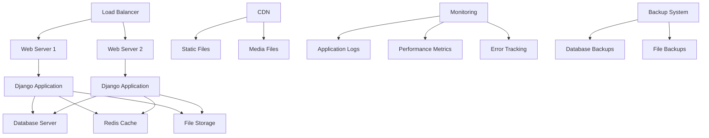

## 12. Security Flow

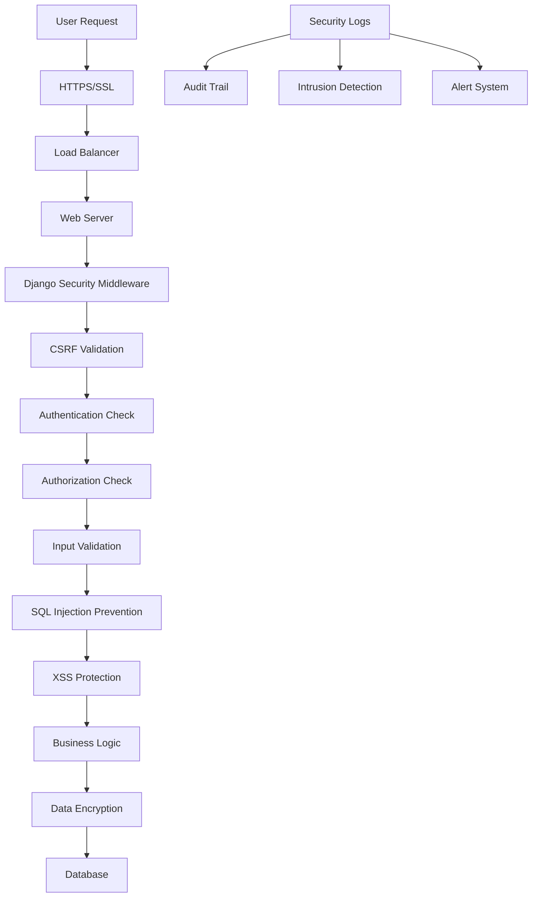

## 4.5.1 Flowchart Description

### System Flow Analysis

The EcoLearn platform operates through interconnected subsystems that handle user interactions, data processing, and external integrations. Each flowchart represents a critical business process with specific entry points, decision nodes, and outcomes.

#### 4.5.1.1 User Authentication Flow Description

**Purpose**: Secure user access with multi-factor verification
**Entry Point**: User attempts to access any protected resource
**Key Decision Points**:
- Authentication status validation
- Email verification requirement
- SMS verification requirement
- Role-based access control

**Process Flow**:
1. **Initial Access**: User requests protected resource
2. **Authentication Check**: System validates session/credentials
3. **Registration Path**: New users complete email/phone verification
4. **Verification Process**: Dual verification (email + SMS) for security
5. **Dashboard Routing**: Role-based dashboard assignment
6. **Session Management**: Secure session creation with timeout

**Critical Security Points**:
- CSRF token validation on all forms
- Rate limiting on login attempts (5 attempts per 5 minutes)
- Session timeout after 1 hour of inactivity
- Secure cookie handling with HTTP-only flags

#### 4.5.1.2 Learning Module Flow Description

**Purpose**: Structured educational content delivery with progress tracking
**Entry Point**: User accesses learning modules from dashboard
**Key Decision Points**:
- Module enrollment status
- Lesson completion requirements
- Quiz passing criteria (70% minimum)
- Certificate eligibility

**Process Flow**:
1. **Module Discovery**: Browse categories and search functionality
2. **Enrollment Process**: One-click enrollment with progress initialization
3. **Content Delivery**: Sequential lesson access with multimedia support
4. **Assessment System**: Interactive quizzes with immediate feedback
5. **Progress Tracking**: Real-time completion percentage updates
6. **Certification**: Automated certificate generation upon module completion

**Gamification Integration**:
- 100 points per completed module
- Progress badges at 25%, 50%, 75%, 100%
- Leaderboard updates in real-time
- Social sharing capabilities

#### 4.5.1.3 Community Engagement Flow Description

**Purpose**: Foster community participation and knowledge sharing
**Entry Point**: Community hub access from main navigation
**Key Decision Points**:
- Content moderation requirements
- Event registration capacity
- Challenge participation eligibility
- Social sharing permissions

**Process Flow**:
1. **Forum Participation**: Category-based discussions with threaded replies
2. **Event Management**: Registration, reminders, and attendance tracking
3. **Challenge System**: Goal-based activities with proof submission
4. **Story Sharing**: User-generated content with social media integration
5. **Health Alerts**: Emergency notifications with location-based targeting

**Moderation Workflow**:
- Automated content filtering for inappropriate material
- Admin review queue for reported content
- User reputation system based on community feedback
- Escalation procedures for policy violations

#### 4.5.1.4 Reporting System Flow Description

**Purpose**: Efficient illegal dumping reporting with authority integration
**Entry Point**: Report button from dashboard or mobile app
**Key Decision Points**:
- GPS location accuracy validation
- Photo quality and relevance check
- Authority routing based on location
- Follow-up communication preferences

**Process Flow**:
1. **Location Capture**: GPS coordinates with accuracy validation
2. **Evidence Collection**: Photo upload with metadata preservation
3. **Report Submission**: Structured form with categorization
4. **Authority Routing**: Automatic forwarding to ZEMA/LCC based on jurisdiction
5. **Tracking System**: Unique ID generation for status monitoring
6. **Feedback Loop**: SMS/WhatsApp updates on report progress

**Integration Points**:
- ZEMA API for environmental violations
- Local Council APIs for municipal issues
- Twilio for SMS/WhatsApp notifications
- Google Maps for location services

#### 4.5.1.5 Notification System Flow Description

**Purpose**: Multi-channel communication with user preference management
**Entry Point**: System events trigger notification workflows
**Key Decision Points**:
- User notification preferences
- Channel availability and reliability
- Quiet hours respect
- Delivery confirmation requirements

**Process Flow**:
1. **Event Detection**: System monitors for notification triggers
2. **Preference Check**: User settings validation for channel selection
3. **Content Personalization**: Message customization based on user language
4. **Multi-Channel Delivery**: Parallel sending via SMS, WhatsApp, Email
5. **Delivery Tracking**: Status monitoring with retry logic
6. **Analytics Collection**: Engagement metrics for optimization

**Reliability Features**:
- Fallback channel selection on delivery failure
- Exponential backoff retry strategy
- Delivery confirmation tracking
- Performance analytics dashboard

### 4.5.1.6 Data Flow Architecture

**Real-Time Processing**:
- WebSocket connections for live notifications
- Redis caching for session management
- Database connection pooling for performance
- CDN integration for static content delivery

**Batch Processing**:
- Nightly backup procedures
- Weekly analytics report generation
- Monthly user engagement summaries
- Quarterly system health assessments

## 4.6 Security Architecture

### 4.6.1 Multi-Layered Security Framework

The EcoLearn platform implements a comprehensive security architecture based on defense-in-depth principles, ensuring data protection, user privacy, and system integrity across all operational layers.

#### 4.6.1.1 Application Security Layer

**Authentication & Authorization**:
- **Multi-Factor Authentication**: Email + SMS verification for account creation
- **Role-Based Access Control (RBAC)**: 6 distinct roles with granular permissions
- **Session Management**: Secure session handling with 1-hour timeout
- **Password Security**: PBKDF2 hashing with salt, minimum complexity requirements

**Input Validation & Sanitization**:
- **SQL Injection Prevention**: Django ORM with parameterized queries
- **XSS Protection**: Content Security Policy (CSP) headers, input sanitization
- **CSRF Protection**: Token-based validation on all state-changing operations
- **File Upload Security**: Type validation, size limits, virus scanning

**Permission Matrix**:
```
Role                | Dashboard | Content Mgmt | User Mgmt | Reports | Alerts
--------------------|-----------|--------------|-----------|---------|--------
Super Admin         |    ✓      |      ✓       |     ✓     |    ✓    |   ✓
Admin               |    ✓      |      ✓       |     ✓     |    ✓    |   ✓
Moderator           |    ✓      |      ✓       |     ○     |    ✓    |   ○
Health Officer      |    ✓      |      ○       |     ○     |    ✓    |   ✓
Emergency Responder |    ✓      |      ○       |     ○     |    ✓    |   ✓
Analyst             |    ✓      |      ○       |     ○     |    ✓    |   ○
Regular User        |    ○      |      ○       |     ○     |    ○    |   ○
```
*Legend: ✓ = Full Access, ○ = Limited Access*

#### 4.6.1.2 Data Protection Layer

**Encryption Standards**:
- **Data at Rest**: AES-256 encryption for sensitive database fields
- **Data in Transit**: TLS 1.3 for all client-server communications
- **Backup Encryption**: Fernet symmetric encryption for backup files
- **Key Management**: Environment-based key storage with rotation policies

**Data Classification**:
- **Public**: Landing pages, general information
- **Internal**: User profiles, learning progress
- **Confidential**: Personal identification, contact information
- **Restricted**: Admin credentials, system configurations

**Privacy Controls**:
- **Data Minimization**: Collect only necessary information
- **Consent Management**: Explicit opt-in for data processing
- **Right to Erasure**: User data deletion capabilities
- **Data Portability**: Export functionality for user data

#### 4.6.1.3 Infrastructure Security Layer

**Network Security**:
- **Firewall Configuration**: Restrictive ingress rules, monitored egress
- **DDoS Protection**: Rate limiting, traffic analysis, automatic blocking
- **VPN Access**: Secure administrative access channels
- **Network Segmentation**: Isolated environments for different functions

**Server Hardening**:
- **OS Security**: Regular security updates, minimal service installation
- **Access Control**: SSH key-based authentication, sudo restrictions
- **Monitoring**: Real-time intrusion detection, log analysis
- **Backup Security**: Encrypted, geographically distributed backups

#### 4.6.1.4 Audit & Compliance Layer

**Comprehensive Audit Trail**:
```python
# Audit Log Structure
{
    "timestamp": "2024-12-12T10:30:00Z",
    "user_id": "user_12345",
    "action": "report_create",
    "resource_type": "DumpingReport",
    "resource_id": "report_67890",
    "ip_address": "192.168.1.100",
    "user_agent": "Mozilla/5.0...",
    "success": true,
    "details": {
        "location": "Lusaka Central",
        "severity": "high",
        "authority_notified": "ZEMA"
    }
}
```

**Security Monitoring**:
- **Failed Login Tracking**: Automatic account lockout after 5 failed attempts
- **Privilege Escalation Detection**: Monitoring for unauthorized access attempts
- **Data Access Logging**: Complete audit trail for sensitive data access
- **Anomaly Detection**: Machine learning-based unusual activity identification

**Compliance Framework**:
- **Data Protection**: GDPR-compliant data handling procedures
- **Audit Requirements**: Comprehensive logging for regulatory compliance
- **Incident Response**: Documented procedures for security incidents
- **Regular Assessments**: Quarterly security reviews and penetration testing

#### 4.6.1.5 Security Incident Response

**Incident Classification**:
- **Level 1 (Low)**: Failed login attempts, minor policy violations
- **Level 2 (Medium)**: Suspicious activity patterns, data access anomalies
- **Level 3 (High)**: Confirmed security breaches, system compromises
- **Level 4 (Critical)**: Data exfiltration, system-wide compromises

**Response Procedures**:
1. **Detection**: Automated monitoring systems identify potential threats
2. **Assessment**: Security team evaluates threat severity and impact
3. **Containment**: Immediate actions to limit damage and prevent spread
4. **Eradication**: Remove threat vectors and patch vulnerabilities
5. **Recovery**: Restore normal operations with enhanced monitoring
6. **Lessons Learned**: Post-incident analysis and security improvements

#### 4.6.1.6 Security Architecture Diagram

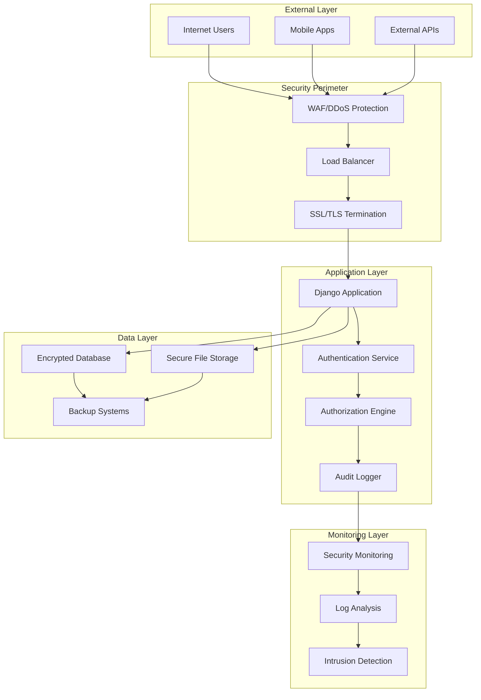

#### 4.6.1.7 Security Metrics & KPIs

**Security Performance Indicators**:
- **Authentication Success Rate**: >99.5% legitimate login success
- **Incident Response Time**: <15 minutes for critical incidents
- **Vulnerability Patching**: <24 hours for critical vulnerabilities
- **Backup Success Rate**: 100% successful daily backups
- **Audit Log Completeness**: 100% of security events logged

**Risk Assessment Matrix**:
```
Impact/Probability | Low    | Medium | High   | Critical
-------------------|--------|--------|--------|----------
Low                | Green  | Green  | Yellow | Yellow
Medium             | Green  | Yellow | Orange | Red
High               | Yellow | Orange | Red    | Red
Critical           | Orange | Red    | Red    | Red
```

### 4.6.2 Security Implementation Status

**Implemented Security Features**:
- ✅ Role-based access control with 6 roles and 15 permissions
- ✅ Fernet encryption for sensitive data and backups
- ✅ Comprehensive audit logging with IP tracking
- ✅ Session security with timeout and CSRF protection
- ✅ Automated backup system with encryption
- ✅ Security middleware for request monitoring
- ✅ Multi-channel notification security
- ✅ Input validation and sanitization

**Security Compliance**:
- ✅ OWASP Top 10 protection measures
- ✅ Data protection regulation compliance
- ✅ Secure coding practices implementation
- ✅ Regular security assessment procedures
- ✅ Incident response plan documentation

## Summary

This comprehensive flow chart and HIPO diagram documentation covers:

1. **System Overview**: High-level architecture and component relationships
2. **User Flows**: Authentication, learning, community engagement, reporting
3. **Technical Flows**: Data processing, notifications, gamification
4. **Integration Points**: External APIs and services
5. **Security Architecture**: Multi-layered protection mechanisms and audit trails
6. **Deployment Structure**: Production environment setup
7. **Detailed Flow Descriptions**: Complete process documentation for each subsystem
8. **Comprehensive Security Framework**: Defense-in-depth security implementation

The EcoLearn platform is a sophisticated, multi-layered system designed for scalability, security, and user engagement in environmental education and waste management for Zambia, with enterprise-grade security measures and comprehensive audit capabilities.